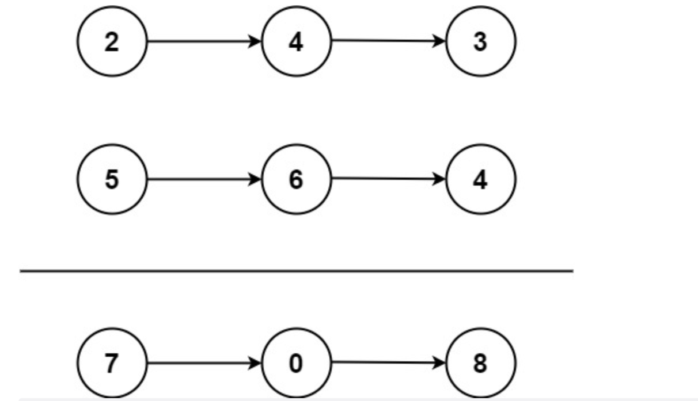

### 两数相加


#### 题目描述

给两个非空的链表，表示两个非负的整数。它们每位数字都是按照逆序的方式存储的，并且每个节点只能存储一位数字。

请你将两个数相加，并以相同形式返回一个表示和的链表。

你可以假设除了数字 0 之外，这两个数都不会以 0 开头。


**示例1：**



```js
输入：(2 -> 4 -> 3) + (5 -> 6 -> 4)
输出：7 -> 0 -> 8
原因：342 + 465 = 807
```


**示例2：**

```js
输入：(9 -> 9 -> 9 -> 9 -> 9 -> 9) + (9 -> 9 -> 9)
输出：(8 -> 9 -> 9 -> 0 -> 0 -> 0 -> 1)
```


#### 解题思路


这是一个典型的链表操作，2 + 5 = 7，4 + 6 = 10，取个位为 0，十位 1 在后面加上，3 + 4 = 7，但是需要补上前面的 1，所以是 8


#### 代码实现

```js
/**
 * Definition for singly-linked list.
 * function ListNode(val, next) {
 *     this.val = (val===undefined ? 0 : val)
 *     this.next = (next===undefined ? null : next)
 * }
 */
/**
 * @param {ListNode} l1
 * @param {ListNode} l2
 * @return {ListNode}
 */
var addTwoNumbers = function(l1, l2) {
  const l3 = new ListNode(0) // 用来保存结果的链表
  let carry = 0 // 记录每次相加之后的进位值
  let p3 = l3 // 定义两个指针，指向结果链表，避免 l3 被改

  while(l1 || l2) {
    const val1 = l1 ? l1.val : 0
    const val2 = l2 ? l2.val : 0
    const val = val1 + val2 + carry
    carry = Math.floor(val / 10) // 计算进位的值
    p3.next = new ListNode(val % 10) // 将个位的值作为当前位的结果
    if (l1) l1 = l1.next // 指针指向下一个节点
    if (l2) l2 = l2.next
    p3 = p3.next
  }

  // 如果进位还有值，直接放到结果链表
  if (carry) {
    p3.next = new ListNode(carry)
  }

  return l3.next
}
```


#### 提交结果


