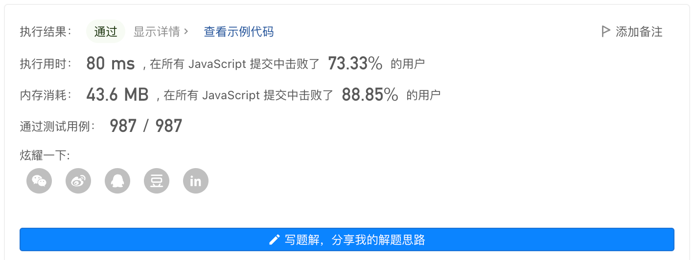

### 无重复字符的最长串


#### 题目描述

给定一个字符串 s ，请你找出其中不含有重复字符的 最长子串 的长度。


**示例1：**

```js
输入: s = "abcabcbb"
输出: 3 
解释: 因为无重复字符的最长子串是 "abc"，所以其长度为 3
```


**示例2：**

```js
输入: s = "bbbbb"
输出: 1
解释: 因为无重复字符的最长子串是 "b"，所以其长度为 1。
```


**示例3：**

```js
输入: s = "pwwkew"
输出: 3
解释: 因为无重复字符的最长子串是 "wke"，所以其长度为 3。
     请注意，你的答案必须是 子串 的长度，"pwke" 是一个子序列，不是子串。
```


#### 解题思路

这个题目可以使用**双指针+map**来实现：

- 首先用双指针维护一个滑动窗口用来剪切子串
- 开始时，两个指针都在起始位置，不断移动右指针，遇到重复的字符，就将左指针向后移动一位
- 右指针每次移动，都计算出两个指针之间的字符个数，并返回最大值
- 每次右指针移动还需要将右指针的索引和值存在Map中，便于后面遇到重复值时让左指针进行移动

该算法的**时间复杂度为O(n)**，**空间复杂度为O(m)**，其中m是最长子串的长度。


#### 代码实现

```js
var lengthOfLongestSubstring = function(s) {
  let max = 0 // 结果
  const map = new Map()
  let left = 0 // 左指针
  const len = s.length

  for (let right = 0; right < len; right++) {
    const char = s[right]
    const idx = map.get(char)
    // 如果有重复，那么左指针移到重复字符的下一位
    // 注意同时满足重复字符的索引大于左指针
    if (map.has(char) && idx >= left) {
      left = idx + 1
    }
    max = Math.max(max, right - left + 1) // 计算结果
    map.set(char, right) // 存下指针位置
  }
  return max
}
```


#### 提交结果



